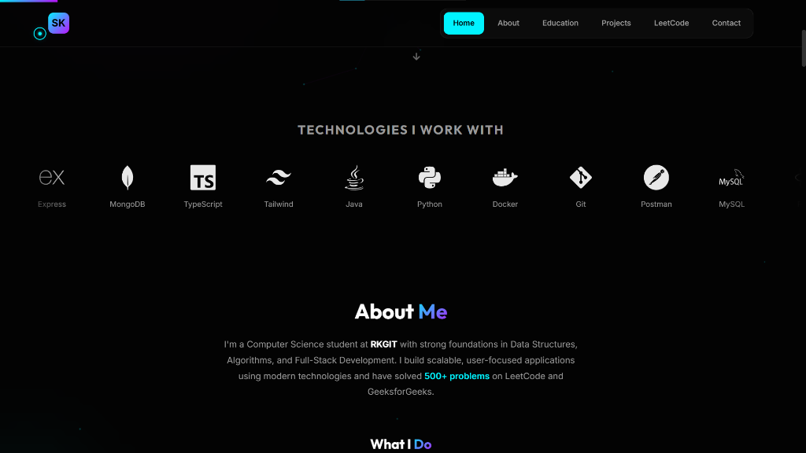
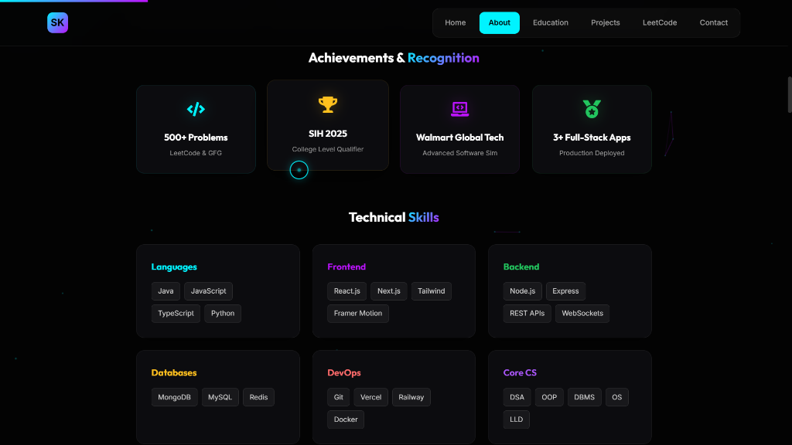
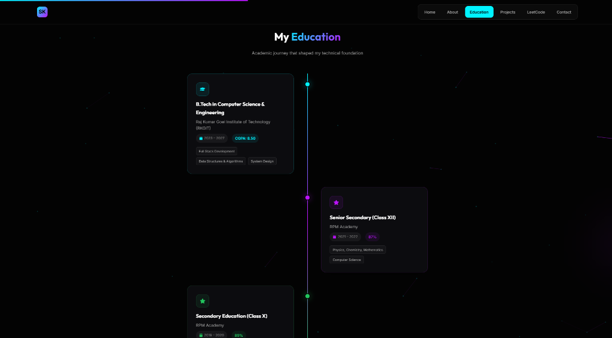
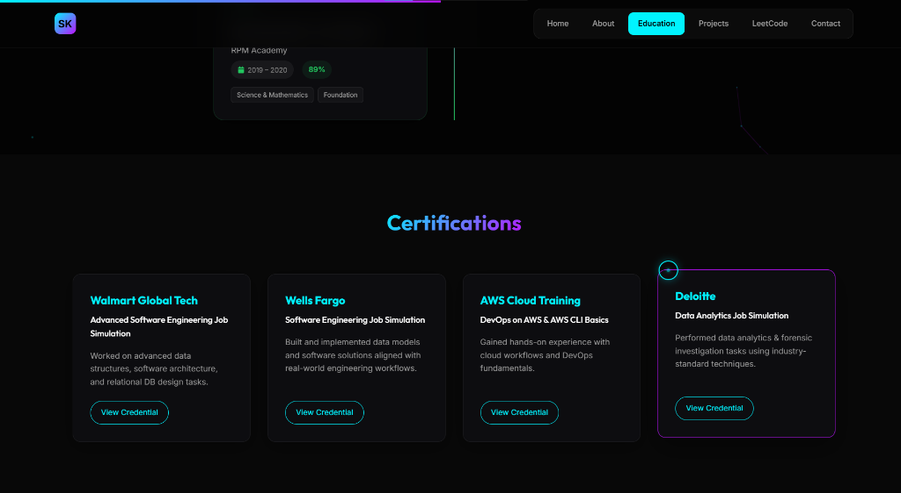

<div align="center">

# ⚡ Sarthak Kanoi - Personal Portfolio

### A Premium, Modern Portfolio Showcasing Full-Stack Development & DSA Expertise

[](https://personal-portfolio-lake-nu-22.vercel.app/)
[](https://github.com/iam-sarthakdev/Personal-Portfolio)

---

</div>

## 🌟 Portfolio Live Preview

<p align="center">
  
</p>

<p align="center">
  
</p>

<p align="center">
  
</p>

<p align="center">
  
</p>

<p align="center">
  
</p>

---

## 📌 Table of Contents

- [About This Portfolio](#-about-this-portfolio)
- [Key Features](#-key-features)
- [Featured Projects](#-featured-projects)
- [Tech Stack](#%EF%B8%8F-tech-stack)
- [Portfolio Sections](#-portfolio-sections-deep-dive)
- [Installation](#-installation--run-locally)
- [Deployment](#-deployment)
- [Contact](#-contact)

---

## 🎯 About This Portfolio

This is a **premium, high-performance personal portfolio** built with the MERN Stack, featuring advanced animations, real-time data integration, and a clean, modern UI design. The portfolio showcases my journey as a Full-Stack Developer with expertise in Data Structures & Algorithms.

### Why This Portfolio Stands Out:
- **🎨 Premium UI/UX**: Glassmorphism design, smooth animations, and micro-interactions
- **⚡ Performance-First**: Optimized build with lazy loading and efficient rendering
- **📊 Real-Time Data**: Live LeetCode stats, GitHub activity, and dynamic content
- **📱 Fully Responsive**: Seamless experience across all devices
- **🔒 Secure Backend**: MongoDB integration for contact form with validation

---

## ✨ Key Features

| Feature | Description |
|---------|-------------|
| **🌈 Morphing Blob Animation** | Dynamic 3D-style blob with orbiting rings in hero section |
| **📍 Active Section Tracking** | Navbar highlights current scroll position |
| **💬 Functional Contact Form** | MongoDB-backed form with validation and feedback |
| **📈 Live LeetCode Stats** | Real-time problem count, difficulty breakdown, heatmap |
| **🎯 Topic Distribution Chart** | Visual breakdown of solved problems by DSA topic |
| **🕐 Vertical Timeline** | Animated education journey with alternating cards |
| **🏆 Achievement Cards** | Highlighted accomplishments with colored icons |
| **🔧 Tech Stack Marquee** | Auto-scrolling technology showcase |
| **📜 Certifications Grid** | Professional certifications with credential links |
| **🖼️ Project Showcases** | Detailed project cards with screenshots |

---

## 🚀 Featured Projects

### 1️⃣ FAANG-Forge - Interview Preparation Platform

> **Master Your Coding Interviews with Spaced Repetition**

<table>
<tr>
<td width="60%">

**🔗 Links:**
| | |
|---|---|
| 🌐 **Live Demo** | [algo-flow-khaki.vercel.app](https://algo-flow-khaki.vercel.app/) |
| 💻 **GitHub** | [iam-sarthakdev/FAANG-Forge](https://github.com/iam-sarthakdev/FAANG-Forge) |

**💡 Key Features:**
- Spaced Repetition Algorithm (Day 1→3→7→14→30→60→90)
- 2,892+ problems from 20+ FAANG companies
- 14+ DSA pattern auto-tagging
- NeetCode 150, Striver A2Z, Love Babbar 450 sheets
- Real-time analytics dashboard

</td>
<td width="40%">

**🛠️ Tech Stack:**
- React, Node.js, Express
- MongoDB, JWT Auth
- Tailwind CSS, Recharts

</td>
</tr>
</table>

---

### 2️⃣ DevSync - Real-Time Collaborative Code Editor

> **Collaboration, Synchronized. The Future of Pair Programming.**

<table>
<tr>
<td width="60%">

**🔗 Links:**
| | |
|---|---|
| 🌐 **Live Demo** | [devsync-production-00b7.up.railway.app](https://devsync-production-00b7.up.railway.app/) |
| 💻 **GitHub** | [iam-sarthakdev/DevSync](https://github.com/iam-sarthakdev/DevSync) |

**💡 Key Features:**
- Real-time code collaboration with live cursors
- Monaco Editor (VS Code's engine)
- Code execution for 40+ languages
- Interactive whiteboard for sketching
- Room-based private sessions

</td>
<td width="40%">

**🛠️ Tech Stack:**
- Next.js, TypeScript
- Socket.IO, Monaco Editor
- Piston API, Tailwind CSS

</td>
</tr>
</table>

---

### 3️⃣ MockMate AI - AI-Powered Interview Simulator

> **Master Your Interviews with Real-Time Voice AI**

<table>
<tr>
<td width="60%">

**🔗 Links:**
| | |
|---|---|
| 🌐 **Live Demo** | [mockmateai-eight.vercel.app](https://mockmateai-eight.vercel.app/landingPage) |
| 💻 **GitHub** | [iam-sarthakdev/MockMate-AI](https://github.com/iam-sarthakdev/MockMate-AI) |

**💡 Key Features:**
- VAPI Voice AI with sub-second latency
- Behavioral, Technical, System Design modes
- STAR method questioning
- Live audio visualization
- Confidence & score metrics

</td>
<td width="40%">

**🛠️ Tech Stack:**
- Next.js 14, TypeScript
- VAPI AI, MongoDB
- NextAuth.js, Framer Motion

</td>
</tr>
</table>

---

## 🛠️ Tech Stack

### **Frontend**
| Technology | Purpose |
|------------|---------|
| React 19 | UI Library with Hooks |
| Vite | Lightning-fast Build Tool |
| Framer Motion | Advanced Animations |
| tsparticles | Interactive Particle Effects |
| Typed.js | Dynamic Typing Animation |
| Lenis | Smooth Scroll Experience |

### **Backend**
| Technology | Purpose |
|------------|---------|
| Node.js | JavaScript Runtime |
| Express.js | Web Framework |
| MongoDB + Mongoose | Database & ODM |
| Vercel Serverless | API Functions |

### **Deployment**
| Platform | Use |
|----------|-----|
| Vercel | Frontend + Serverless Backend |
| MongoDB Atlas | Cloud Database |

---

## 📖 Portfolio Sections Deep-Dive

### 🏠 Hero Section
The hero section features a **morphing blob animation** with orbiting rings, an availability badge, terminal-style typing animation, and prominent CTA buttons. Social links include LinkedIn, GitHub, and LeetCode.

### 👤 About Section
Showcases background, a scrolling tech marquee, "What I Do" cards (Full-Stack, DSA, System Design, UI/UX), achievements (500+ problems, SIH 2025, Walmart Global Tech), and a categorized skills grid.

### 🎓 Education Section
Features a **vertical timeline** with gradient colors (cyan → purple → green), alternating cards for each education entry, colored timeline dots, and highlight tags for subjects/skills.

### 💼 Projects Section
Each project has its own card with local screenshots, detailed descriptions from GitHub READMEs, expandable "Read More" sections, key features with icons, and tech stack badges.

### 📊 LeetCode Stats Section
Displays real-time stats via API, animated counters for total solved/streak/hard problems, difficulty breakdown with progress bars, topic distribution chart (10 DSA categories), and a GitHub-style contribution heatmap.

### 📜 Certifications Section
Grid of professional certifications including Walmart Global Tech, Wells Fargo, AWS Cloud Training, and Deloitte Data Analytics, each with a "View Credential" link.

### 📬 Contact Section
Two-column layout with contact info (email, LinkedIn, GitHub, location) and a functional form with labeled inputs, focus animations, status messages, and loading states.

---

## 📦 Installation & Run Locally

### 1. Clone the Repository
```bash
git clone https://github.com/iam-sarthakdev/Personal-Portfolio.git
cd Personal-Portfolio
```

### 2. Frontend Setup
```bash
cd client
npm install
npm run dev
```

### 3. Backend Setup
```bash
cd ..
npm install
```

Create a `.env` file:
```env
MONGO_URI=your_mongodb_connection_string
PORT=3000
```

Start the server:
```bash
node server.js
```

---

## 🚀 Deployment

This project is configured for **Vercel** deployment:

1. Push code to GitHub
2. Import project in Vercel
3. Set Framework Preset to "Other"
4. Add `MONGO_URI` in Environment Variables
5. Deploy!

---

## 📬 Contact

<div align="center">

| Platform | Link |
|----------|------|
| 📧 **Email** | sarthak1712005@gmail.com |
| 💼 **LinkedIn** | [Sarthak Kanoi](https://www.linkedin.com/in/sarthak-kanoi-b49475362/) |
| 🐙 **GitHub** | [iam-sarthakdev](https://github.com/iam-sarthakdev) |
| 💻 **LeetCode** | [Sarthak_1712](https://leetcode.com/u/Sarthak_1712/) |

</div>

---

<div align="center">

### ⭐ If you like this project, give it a star!

Made with ❤️ by **Sarthak Kanoi**

</div>
