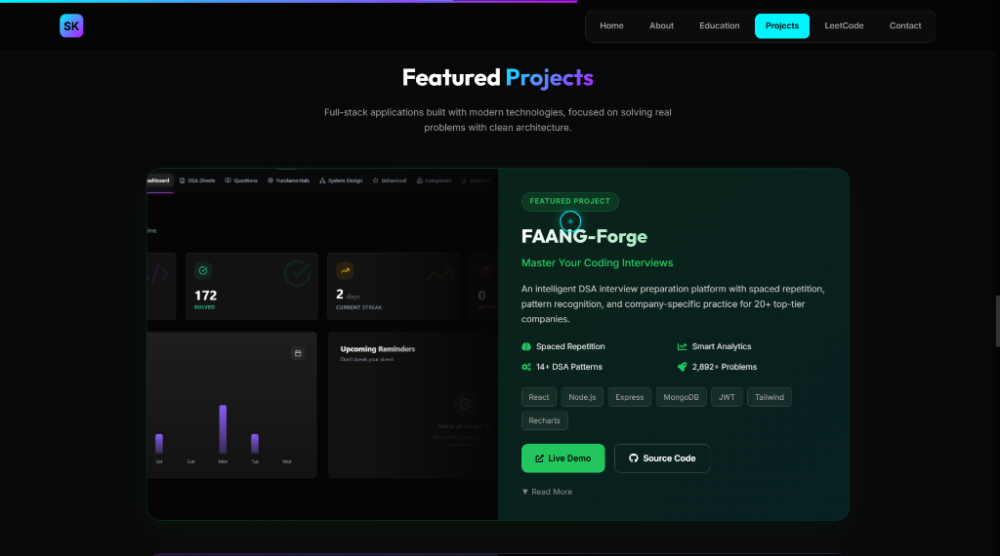
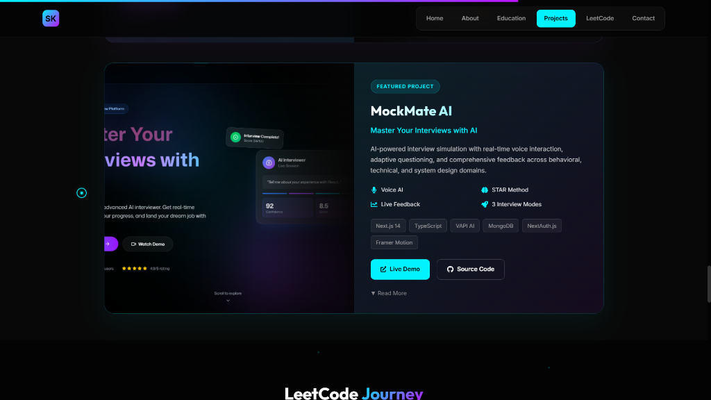
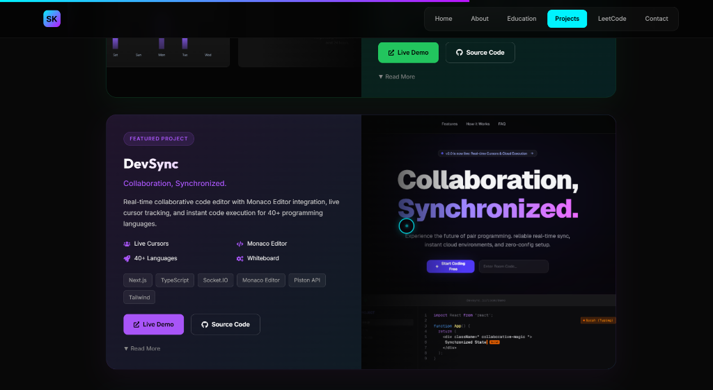
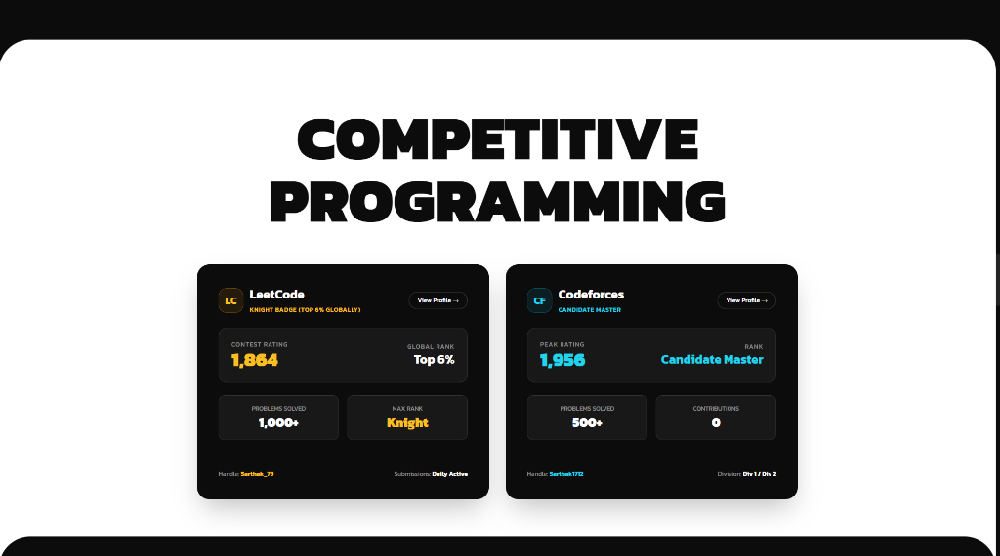
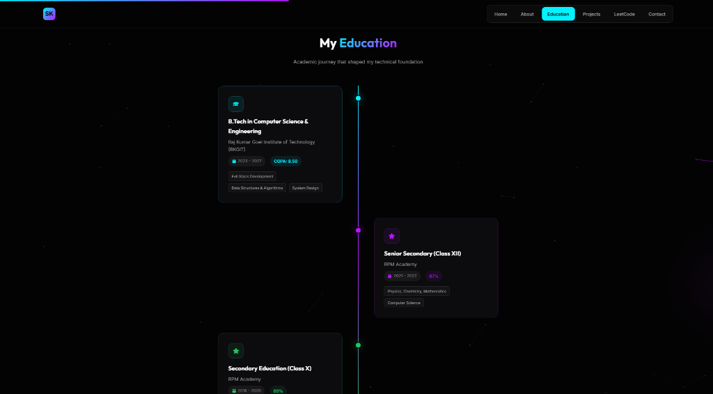

<div align="center">

# ⚡ Sarthak Kanoi - Personal Portfolio

### A Premium, Modern Portfolio Showcasing Full-Stack Development & Competitive Programming Expertise

[](https://personal-portfolio-lake-nu-22.vercel.app/)
[](https://github.com/iam-sarthakdev/Personal-Portfolio)

---

</div>

## 🌟 Portfolio Live Preview

<p align="center">
  
</p>

<p align="center">
  
</p>

<p align="center">
  
</p>

<p align="center">
  
</p>

<p align="center">
  
</p>

---

## 📌 Table of Contents

- [About This Portfolio](#-about-this-portfolio)
- [Key Features](#-key-features)
- [Featured Projects](#-featured-projects)
- [Tech Stack](#%EF%B8%8F-tech-stack)
- [Portfolio Sections](#-portfolio-sections-deep-dive)
- [Installation](#-installation--run-locally)
- [Deployment](#-deployment)
- [Contact](#-contact)

---

## 🎯 About This Portfolio

This is a **premium, high-performance personal portfolio** built with React, Vite, Framer Motion, and Tailwind CSS, featuring 3D interactive elements, real-time metrics, and a dark luxury design. The portfolio showcases my journey as a Software Engineer specializing in High-Performance Backend Systems & Competitive Programming (**Candidate Master @Codeforces 1956**, **Knight @LeetCode 1864**).

### Why This Portfolio Stands Out:
- **🎨 Premium Dark Luxury UI/UX**: Custom Kanit typography, sleek dark mode (`#0C0C0C`), smooth scroll cards, and interactive 3D avatar
- **⚡ Performance-First**: Ultra-fast Vite build pipeline with responsive viewport containment
- **📊 Real-Time Metrics**: Live LeetCode & Codeforces rating metrics (1500+ problems solved)
- **📱 Fully Responsive**: Custom layout scaling across mobile, tablet, and widescreen displays
- **🔒 Production Ready**: Deployed cleanly on Vercel

---

## ✨ Key Features

| Feature | Description |
|---------|-------------|
| **🎭 Interactive 3D Boy Portrait** | Centered 3D character with magnetic mouse tracking |
| **📍 Responsive Header** | Brand heading auto-scaled (`text-[8.5vw]...`) with zero overflow |
| **🏆 Competitive Stats Cards** | LeetCode Knight (1864) and Codeforces Candidate Master (1956) cards |
| **🕐 Vertical Education Timeline** | Academic journey from B.Tech CSE at RKGIT to high school |
| **🏆 Achievements & Recognition** | 1500+ problems, top 6% global rank, full-stack app achievements |
| **🔧 Tech Stack Marquee** | Auto-scrolling technology showcase |
| **📜 Certifications Grid** | Professional certifications with credential links |
| **🖼️ Sticky Project Cards** | Scroll-driven 3D stack cards for FAANG-Forge, MockMate AI, & DevSync |

---

## 🚀 Featured Projects

### 1️⃣ FAANG-Forge - Full-Stack DSA Platform

> **Master DSA The Smart Way with Spaced Repetition**

<p align="center">
  
</p>

<table>
<tr>
<td width="60%">

**🔗 Links:**
| | |
|---|---|
| 🌐 **Live Demo** | [algo-flow-khaki.vercel.app](https://algo-flow-khaki.vercel.app/) |
| 💻 **GitHub** | [iam-sarthakdev/FAANG-Forge](https://github.com/iam-sarthakdev/FAANG-Forge) |

**💡 Key Features:**
- Algorithmic problem tracker featuring built-in Java code editor
- Solution vaults & practice mode
- Codeforces API sync
- 2,800+ categorized DSA problems

</td>
<td width="40%">

**🛠️ Tech Stack:**
- React, Node.js, Express
- MongoDB, Monaco Editor
- Tailwind CSS, Framer Motion

</td>
</tr>
</table>

---

### 2️⃣ MockMate AI - AI Interview Defense Platform

> **Master Your Interviews with AI Voice Assistance**

<p align="center">
  
</p>

<table>
<tr>
<td width="60%">

**🔗 Links:**
| | |
|---|---|
| 🌐 **Live Demo** | [mockmateai-eight.vercel.app](https://mockmateai-eight.vercel.app/landingPage) |
| 💻 **GitHub** | [iam-sarthakdev/MockMate-AI](https://github.com/iam-sarthakdev/MockMate-AI) |

**💡 Key Features:**
- Real-time speech evaluation & AI feedback
- Technical & System Design interview modes
- Detailed confidence & score metrics

</td>
<td width="40%">

**🛠️ Tech Stack:**
- Next.js 14, TypeScript
- OpenAI API, Web Audio API
- Tailwind CSS, Framer Motion

</td>
</tr>
</table>

---

### 3️⃣ DevSync - Real-Time Collaboration Platform

> **Collaboration, Synchronized. Real-Time Pair Programming.**

<p align="center">
  
</p>

<table>
<tr>
<td width="60%">

**🔗 Links:**
| | |
|---|---|
| 🌐 **Live Demo** | [devsync-production-00b7.up.railway.app](https://devsync-production-00b7.up.railway.app/) |
| 💻 **GitHub** | [iam-sarthakdev/DevSync](https://github.com/iam-sarthakdev/DevSync) |

**💡 Key Features:**
- Real-time WebSockets synchronization
- WebRTC video calling
- Live AST syntax analysis & room-based pair coding

</td>
<td width="40%">

**🛠️ Tech Stack:**
- React, Express
- WebSockets, WebRTC
- Docker, Tailwind CSS

</td>
</tr>
</table>

---

## 📊 Competitive Programming Stats

<p align="center">
  
</p>

- **LeetCode**: Knight Badge (1,864 Rating) | 1,000+ Problems Solved | Top 6% Globally
- **Codeforces**: Candidate Master (1,956 Peak Rating) | 500+ Problems Solved

---

## 🎓 Education Timeline

<p align="center">
  
</p>

---

## 🛠️ Tech Stack

### **Frontend**
| Technology | Purpose |
|------------|---------|
| React 19 | UI Library with Hooks |
| Vite | Lightning-fast Build Tool |
| Framer Motion | Scroll Animations & 3D Stacking |
| Tailwind CSS | Utility-first Styling |
| Lucide / React Icons | UI Icons |

### **Backend & Deployment**
| Technology | Purpose |
|------------|---------|
| Node.js / Express | API Backend |
| Vercel | Production Hosting & Automated CI/CD |

---

## 📦 Installation & Run Locally

### 1. Clone the Repository
```bash
git clone https://github.com/iam-sarthakdev/Personal-Portfolio.git
cd Personal-Portfolio
```

### 2. Run Client App
```bash
cd client
npm install
npm run dev
```

---

## 📬 Contact

<div align="center">

| Platform | Link |
|----------|------|
| 📧 **Email** | sarthak1712005@gmail.com |
| 💼 **LinkedIn** | [Sarthak Kanoi](https://www.linkedin.com/in/sarthak-kanoi/) |
| 🐙 **GitHub** | [iam-sarthakdev](https://github.com/iam-sarthakdev) |
| 💻 **LeetCode** | [Sarthak_79](https://leetcode.com/u/Sarthak_79/) |
| 🏆 **Codeforces** | [Sarthak1712](https://codeforces.com/profile/Sarthak1712) |

</div>

---

<div align="center">

### ⭐ If you like this project, give it a star!

Made with ❤️ by **Sarthak Kanoi**

</div>
